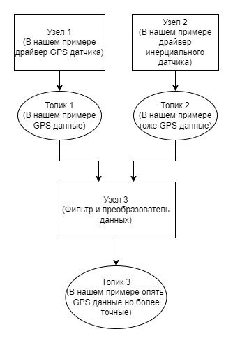

# Я, ROS и мой первый пакет (не из пятерочки)

## Содержание

- [Я, ROS и мой первый пакет (не из пятерочки)](#я-ros-и-мой-первый-пакет-не-из-пятерочки)
  - [Содержание](#содержание)
  - [Что нужно, чтобы начать?](#что-нужно-чтобы-начать)
  - [Рабочие пространства в ROS 2](#рабочие-пространства-в-ros-2)
    - [Основные папки рабочего пространства](#основные-папки-рабочего-пространства)
    - [Самое важное на старте](#самое-важное-на-старте)
    - [Почему именно так устроено?](#почему-именно-так-устроено)
    - [Что мы сделаем дальше](#что-мы-сделаем-дальше)
    - [Подготовка рабочего пространства (workspace -\> ws)](#подготовка-рабочего-пространства-workspace---ws)
      - [Шаг за шагом](#шаг-за-шагом)
      - [Добавить подключение рабочего пространства в сессию терминала](#добавить-подключение-рабочего-пространства-в-сессию-терминала)
    - [Проверка установки](#проверка-установки)
    - [Пространство готово — теперь создаём пакет](#пространство-готово--теперь-создаём-пакет)
      - [1. Переходим в папку src нашего рабочего пространства](#1-переходим-в-папку-src-нашего-рабочего-пространства)
      - [2. Создаём новый пакет](#2-создаём-новый-пакет)
      - [3. Что появилось после создания пакета](#3-что-появилось-после-создания-пакета)
      - [4. Основные блоки файла package.xml](#4-основные-блоки-файла-packagexml)
    - [Разместим новый пакет в репозиторий на GitHub](#разместим-новый-пакет-в-репозиторий-на-github)
    - [Размещаем пакет на GitHub](#размещаем-пакет-на-github)
      - [Шаг 1. Создаём репозиторий на GitHub](#шаг-1-создаём-репозиторий-на-github)
      - [Шаг 2. Переходим в папку пакета](#шаг-2-переходим-в-папку-пакета)
      - [Шаг 3. Инициализируем Git и переходим на ветку main](#шаг-3-инициализируем-git-и-переходим-на-ветку-main)
      - [Шаг 4. Подключаем удалённый репозиторий](#шаг-4-подключаем-удалённый-репозиторий)
      - [Шаг 5. Первое связывание (pull + add + commit + push)](#шаг-5-первое-связывание-pull--add--commit--push)
      - [Полезные команды на будущее](#полезные-команды-на-будущее)
    - [Первый узел — Hello ROS 2 World!](#первый-узел--hello-ros-2-world)
      - [1. Создаём файл узла](#1-создаём-файл-узла)
      - [2. Пишем самый простой код](#2-пишем-самый-простой-код)
      - [3. Регистрируем узел в setup.py](#3-регистрируем-узел-в-setuppy)
      - [4. Собираем пакет](#4-собираем-пакет)
      - [5. Запускаем узел](#5-запускаем-узел)
    - [Заливаем наработки в репозиторий в конце работы](#заливаем-наработки-в-репозиторий-в-конце-работы)
      - [Быстрый порядок действий в конце сессии](#быстрый-порядок-действий-в-конце-сессии)
  - [Что нужно сделать](#что-нужно-сделать)
    - [Основное задание](#основное-задание)
  - [Вопросики](#вопросики)


## Что нужно, чтобы начать?


- Установленная **Ubuntu 24.04 LTS** (Noble Numbat) [Скачать →](https://releases.ubuntu.com/24.04/)
- Установленный **ROS 2 Jazzy Jalisco** (рекомендуемый релиз на Ubuntu 24.04) [Официальная инструкция по установке →](https://docs.ros.org/en/jazzy/Installation/Ubuntu-Install-Debs.html)
- Установленный пакет `git`  
  ```bash
  sudo apt update
  sudo apt install git
- Созданный аккаунт на GitHub (github.com → Sign up)

## Основная информация

### Что такое ROS 2?

**ROS 2** (Robot Operating System 2) — это открытая (open-source) платформа и набор инструментов для создания программного обеспечения роботов.  
Это **не операционная система** в привычном смысле, а **middleware-фреймворк**, который работает поверх вашей ОС (обычно Linux) и сильно упрощает разработку робототехнических систем.

ROS 2 предоставляет:

- унифицированный способ обмена данными между модулями  
- готовые типы сообщений для большинства популярных датчиков и задач  
- инструменты для запуска, отладки, визуализации и логирования  
- модульность и повторное использование кода  
- поддержку реального времени, безопасности и распределённых систем

### Почему именно ROS 2, а не старый ROS 1?

| Характеристика             | ROS 1 (Noetic)                          | ROS 2 (Jazzy, 2026 год)                              |
|----------------------------|------------------------------------------|-------------------------------------------------------|
| Архитектура                | Централизованная (обязателен roscore)   | Децентрализованная (DDS)                             |
| Коммуникация               | Собственный протокол                    | Стандарт DDS (реальное время, QoS, шифрование)       |
| Поддержка реального времени| Слабая                                  | Хорошая (bounded latency, RT-исполнители)            |
| Безопасность               | Отсутствует                              | SROS 2, аутентификация, шифрование                   |
| Платформы                  | В основном Linux                        | Linux, Windows, macOS, RTOS                          |
| Статус поддержки (2026)    | EOL — май 2025                          | Активно развивается, LTS Jazzy до мая 2029           |
| Рекомендация               | Только legacy-проекты                   | Стандарт для новых проектов и промышленности         |

### Простой пример: как ROS 2 объединяет робота

Представьте мобильного робота с несколькими датчиками:

- Лидар → облако точек  
- Камера → изображения  
- IMU → ускорения и угловые скорости  
- GPS → координаты  
- Энкодеры колёс → данные о перемещении  

Без ROS 2 пришлось бы вручную писать код для:

- чтения каждого датчика  
- преобразования форматов  
- синхронизации по времени  
- передачи данных между модулями  

С ROS 2 всё работает по-другому:

1. Каждый датчик / драйвер запускается как отдельный **узел** (node)  
2. Узел **публикует** (publish) данные в именованный канал — **топик** (topic)  
3. Другие узлы **подписываются** (subscribe) на нужные топики и автоматически получают данные  
4. Полученные данные можно фильтровать, объединять (sensor fusion), улучшать и публиковать дальше в новый топик

### Классический пример — модуль позиционирования робота

```text
[GPS-драйвер]     ──→  /gps/fix                (NavSatFix)
[IMU-драйвер]     ──→  /imu/data_raw           (Imu)
[Энкодеры]        ──→  /wheel_odom             (Odometry)

                         ↓
          [Фильтр / EKF / UKF / robot_localization]
                         ↓
                   /odom или /pose/fused     (Odometry)
                         ↓
          [Навигация / SLAM / Nav2 / планировщик пути]         
```

- Каждый прямоугольник — это узел
- Стрелки — это топики (один ко многим, многие ко многим)
- Узлы не знают друг о друге напрямую — они общаются только через топики

→ Выключил GPS → робот едет по одометрии
→ Добавил новый датчик → просто запустил ещё один узел

<p align="center">

</p>


## Рабочие пространства в ROS 2

Чтобы создавать сложные робототехнические системы из множества узлов, топиков, параметров и конфигураций, нам нужно правильно организовать место для работы.  
Такое место называется **рабочим пространством** (workspace, часто сокращают до ws).

### Основные папки рабочего пространства

| Папка          | Что внутри                                                                 | Зачем нужна                                                                                  | Создаётся автоматически? |
|----------------|----------------------------------------------------------------------------|----------------------------------------------------------------------------------------------|---------------------------|
| `src/`         | Все ваши **пакеты** (и чужие, которые вы склонировали)                     | Здесь лежит весь исходный код, который вы пишете или используете                             | Да (создаём вручную)     |
| `build/`       | Временные файлы сборки для каждого пакета                                  | Промежуточные результаты компиляции/генерации (можно удалять)                               | Да, при `colcon build`   |
| `install/`     | Установленные файлы пакетов (бинарники, скрипты, share-файлы)             | То, что в итоге запускается через `ros2 run`, `ros2 launch` и т.д.                           | Да, при `colcon build`   |
| `log/`         | Логи сборки и иногда runtime-логи colcon                                   | Помогает понять, почему что-то не собралось или упало                                        | Да, при `colcon build`   |

### Самое важное на старте

- **Рабочих пространств** может быть **несколько**  
  ROS 2 прекрасно поддерживает **overlay** (наложение) — вы можете иметь одно основное пространство + несколько дополнительных для экспериментов или разных проектов.

- **src/** — это сердце рабочего пространства  
  Именно сюда кладутся все пакеты.  
  Именно отсюда начинается вся магия: `ros2 pkg create`, `colcon build`, `ros2 run` и т.д.

- **Пакет** — это минимальная осмысленная единица в ROS 2

> **Пакет** — это набор файлов, объединённых общей задачей или смыслом.  
> Примеры пакетов:
> - `my_camera_driver` — драйвер для вашей USB-камеры  
> - `joystick_teleop` — управление роботом с геймпада  
> - `wheeled_robot_description` — URDF/XACRO + launch-файлы для колёсного робота  
> - `person_follower` — узел, который следует за человеком по камере  
> - `nav2_bringup_custom` — ваша кастомная конфигурация навигации

В интернете уже тысячи готовых пакетов (Navigation2, MoveIt 2, perception пакеты, драйверы лидаров и т.д.).  
Большинство из них устанавливаются через `apt` или через `vcs import` из репозиториев, но для начала мы научимся создавать **свои** пакеты.

### Почему именно так устроено?

- Модульность: каждый пакет решает свою задачу → легко заменять, обновлять, переиспользовать  
- Изоляция: можно иметь разные версии одного и того же пакета в разных рабочих пространствах  
- Повторяемость: весь проект (кроме системных зависимостей) лежит в одной папке `src/` → удобно клонировать, коммитить, делиться

### Что мы сделаем дальше

1. Создадим своё первое рабочее пространство `~/ros2_ws`  
2. Создадим внутри него первый пакет  
3. Напишем простейший узел (publisher времени)  
4. Соберём и запустим его с помощью `colcon build` и `ros2 run`

### Подготовка рабочего пространства (workspace -> ws)

В ROS 2 системное рабочее пространство уже автоматически подключено после установки дистрибутива (обычно через `/opt/ros/jazzy/setup.zsh`).  
Поэтому при создании **своего** рабочего пространства не нужно специально подключать системное — ROS 2 сам найдёт и «наложит» (overlay) системные пакеты поверх ваших.

ROS 2 видит только те пакеты, которые находятся в подключённых рабочих пространствах текущей сессии терминала.  
Поэтому сейчас мы создадим своё собственное рабочее пространство — это будет основное место для всех ваших будущих проектов и экспериментов.

Официальная инструкция (очень полезно заглянуть):  
[Creating a workspace →](https://docs.ros.org/en/jazzy/Tutorials/Beginner-Client-Libraries/Creating-A-Workspace/Creating-A-Workspace.html)

#### Шаг за шагом

1. **Создаём структуру рабочего пространства**

   Самое популярное и понятное имя — `ros2_ws`:

   ```bash
   mkdir -p ~/ros2_ws/src
   ```

- Опция -p создаст все родительские папки, если их ещё нет.
- Папка src/ обязательна — именно в неё мы будем класть все пакеты.

2. **Переходим в корень рабочего пространства**

   ```bash
    cd ~/ros2_ws
   ```

3. **Выполняем первую сборку (инициализация)**

   ```bash
    colcon build
   ```

Даже если папка `src/`  пока пустая — команда нужна.
После выполнения появятся три важные папки:
- `build/` — временные файлы сборки (можно спокойно удалять)
- `install/` — сюда попадают готовые к запуску файлы (скрипты, launch-файлы, share)
- `log/` — логи colcon (удобно при отладке ошибок сборки)
Важно: команда `colcon build` не зависит от имени папки.
Назовёте рабочее пространство `my_cool_robot_ws`, `experiments_2026` или `navigation_tests` — команда всё равно будет colcon build.

#### Добавить подключение рабочего пространства в сессию терминала

После первой сборки в папке `~/ros2_ws/install/` появится файл `setup.zsh`.
Его нужно «подгружать» (source) в каждой новой сессии терминала.

```bash
source ~/ros2_ws/install/setup.zsh
```

Сделать это можно как и с системным ws:

```bash
echo "source ~/ros2_ws/install/setup.zsh" >> ~/.zshrc
```

Или открыть файл `~/.zshrc` и прописать ручками.

Теперь при каждом новом открытии терминала ваше рабочее пространство будет автоматически подключаться!

### Проверка установки

После перезапуска терминалов (для настройки сессий) можно проверить установку всех ws

```bash
printenv | grep -i ROS
```

В результате должен появиться путь до созданного рабочего простанства, а также путь до системного рабочего пространства. То есть, строка должна содержать результат, похожий на вот это:

```bash
ROS_VERSION=2
ROS_PYTHON_VERSION=3
ROS_DISTRO=jazzy
COLCON_PREFIX_PATH=/home/ваш_пользователь/ros2_ws/install:...
```

### Пространство готово — теперь создаём пакет

Вся экосистема ROS 2 строится вокруг **пакетов**.  
Пакет — это минимальная осмысленная единица, которая может содержать:

- узлы (nodes)  
- launch-файлы  
- параметры  
- сообщения (.msg), сервисы (.srv), действия (.action)  
- конфигурации, URDF/XACRO, тесты, документацию и многое другое

Пакеты позволяют модульно организовывать код, легко делиться им и повторно использовать.

Официальная документация по созданию пакета (очень рекомендуется заглянуть):  
[Creating Your First ROS 2 Package →](https://docs.ros.org/en/jazzy/Tutorials/Beginner-Client-Libraries/Creating-Your-First-ROS2-Package.html)

#### 1. Переходим в папку src нашего рабочего пространства

```bash
cd ~/ros2_ws/src
```

#### 2. Создаём новый пакет

В ROS 2 для создания пакета используется команда `ros2 pkg create`.
Для Python-пакетов (что чаще всего на старте) указываем тип сборки `--build-type ament_python`.

```bash
ros2 pkg create --build-type ament_python study_pkg
```

Замените study_pkg на уникальное имя, например:
`super_ivan_study_pkg`, `anna_robotics_2026`, `my_first_jazzy_pkg` и т.д.
Имя должно быть уникальным на вашем компьютере — другие студенты/пользователи тоже будут создавать пакеты.

Мы в дальнейшем будем использовать имя `study_pkg`, а ты обязательно заменяй его на своё!

#### 3. Что появилось после создания пакета

После выполнения команды в папке `~/ros2_ws/src/` появится новая директория, например `study_pkg`, со следующей структурой:

```text
study_pkg/
├── package.xml          ← метаданные пакета (обязательный файл)
├── setup.py             ← описание Python-пакета и точки входа (entry points)
├── setup.cfg            ← настройки для Python-пакета
├── resource/            ← служебная папка (не трогаем)
│   └── study_pkg
└── study_pkg/           ← здесь будет лежать ваш Python-код
    └── __init__.py

```

Самые важные файлы на старте:

- package.xml — «паспорт» пакета (имя, версия, описание, зависимости, авторы, лицензия)
- setup.py — точка входа для Python-пакета, здесь регистрируются исполняемые скрипты (узлы)

#### 4. Основные блоки файла package.xml

```bash
<?xml version="1.0"?>
<?xml-model href="http://download.ros.org/schema/package_format3.xsd" schematypens="http://www.w3.org/2001/XMLSchema"?>
<package format="3">
  <name>study_pkg</name>
  <version>0.0.0</version>
  <description>TODO: Package description</description>
  <maintainer email="you@example.com">Your Name</maintainer>
  <license>TODO: License declaration</license>

  <!-- Зависимости -->
  <depend>rclpy</depend>           <!-- основная зависимость для Python-узлов -->
  <depend>std_msgs</depend>        <!-- часто используется для простых сообщений -->

  <!-- Дополнительно (можно добавить позже) -->
  <!-- <test_depend>ament_lint_auto</test_depend> -->
  <!-- <export> ... </export> -->
</package>
```

### Разместим новый пакет в репозиторий на GitHub

### Размещаем пакет на GitHub

Чтобы не потерять код, делиться им и работать с разных компьютеров — сразу кладём пакет в репозиторий.

#### Шаг 1. Создаём репозиторий на GitHub

1. Зайди на https://github.com/new  
2. Придумай имя репозитория (лучше то же, что и имя пакета, например `super_ivan_study_pkg`)  
3. Поставь галочку **«Add a README file»** (чтобы репозиторий не был пустым)  
4. Нажми **Create repository**

> Не добавляй .gitignore и лицензию пока — мы сами их добавим позже, если нужно.

#### Шаг 2. Переходим в папку пакета

```bash
cd ~/ros2_ws/src/study_pkg
```

#### Шаг 3. Инициализируем Git и переходим на ветку main


```bash
git init
git checkout -b main
```

#### Шаг 4. Подключаем удалённый репозиторий

Скопируй HTTPS-ссылку репозитория (зелёная кнопка Code → HTTPS)


```bash
git remote add origin https://github.com/твой_логин/твой_репозиторий.git
```

Проверь, что всё правильно:

```bash
git remote -v
```

#### Шаг 5. Первое связывание (pull + add + commit + push)

```bash
# Стягиваем README.md, который создали на GitHub
git pull origin main --allow-unrelated-histories

# Добавляем все файлы пакета
git add .

# Делаем первый коммит
git commit -m "Initial commit: created study_pkg for ROS 2 Jazzy"

# Отправляем на GitHub
git push -u origin main
```

Первый раз GitHub может попросить логин и Personal Access Token (не обычный пароль!).
Как создать токен → https://github.com/settings/tokens (выбери «classic», scopes: repo)

#### Полезные команды на будущее

```bash
git status          # что изменилось
git add .           # добавить всё
git commit -m "..." # закоммитить
git push            # отправить
git pull            # забрать изменения с GitHub
```

### Первый узел — Hello ROS 2 World!

Мы пришли не просто создавать пакеты — пора писать код!  
Сегодня сделаем самый простой, но уже настоящий **ROS 2 узел** — Hello World.

В ROS 2 **узел** — это отдельная программа, которая:
- запускается независимо,
- может публиковать / подписываться на топики,
- взаимодействует с другими узлами через ROS-сеть.

Сегодня начнём с самого простого — узел, который просто выводит приветствие.

#### 1. Создаём файл узла

В ROS 2 для Python-пакетов принято класть исполняемые скрипты прямо в папку пакета (обычно в `study_pkg/study_pkg/`), а не в отдельную `scripts/`.  
Но для удобства и традиции можно использовать `scripts/` — ROS 2 это поддерживает.

Переходим в папку пакета:

```bash
cd ~/ros2_ws/src/study_pkg
mkdir -p study_pkg/scripts    # создаём вложенную папку, если хотим
touch study_pkg/scripts/first_node.py
```

Если предпочитаешь классический стиль ROS 2 → клади файл прямо в `study_pkg/study_pkg/first_node.py`
Оба варианта работают, но второй — более «родной» для `ament_python`.

#### 2. Пишем самый простой код

Открываем файл в любом редакторе (VS Code, PyCharm, nano и т.д.) и вставляем:

```python
#!/usr/bin/env python3
"""Первый узел ROS 2 — Hello World"""

import rclpy
from rclpy.node import Node

def main(args=None):
    rclpy.init(args=args)                   # инициализация ROS 2
    node = Node('hello_node')               # создаём узел с именем hello_node
    node.get_logger().info("Hello ROS 2 World! 🚀")
    rclpy.spin(node)                        # запускаем цикл обработки
    node.destroy_node()
    rclpy.shutdown()

if __name__ == '__main__':
    main()
```

Это уже настоящий ROS 2 узел, а не просто print().
Он корректно инициализирует ROS, создаёт узел и выводит сообщение через logger.


#### 3. Регистрируем узел в setup.py

Открываем файл `~/ros2_ws/src/study_pkg/setup.py` и добавляем точку входа в раздел `entry_points`:

```bash
from setuptools import setup

package_name = 'study_pkg'

setup(
    name=package_name,
    version='0.0.0',
    packages=[package_name],
    data_files=[
        ('share/ament_index/resource_index/packages',
            ['resource/' + package_name]),
        ('share/' + package_name, ['package.xml']),
    ],
    install_requires=['setuptools'],
    zip_safe=True,
    maintainer='Your Name',
    maintainer_email='you@example.com',
    description='TODO: Package description',
    license='TODO: License',
    tests_require=['pytest'],
    entry_points={
        'console_scripts': [
            'first_node = study_pkg.scripts.first_node:main',   # ← добавляем эту строку
        ],
    },
)
```

Если файл лежит прямо в `study_pkg/study_pkg/first_node.py` → пиши
`'first_node = study_pkg.first_node:main'`


#### 4. Собираем пакет

```bash
cd ~/ros2_ws
colcon build --packages-select study_pkg
source install/setup.zsh
```

#### 5. Запускаем узел

```bash
ros2 run study_pkg first_node
```

Ожидаемый вывод в терминале:

```bash
[INFO] [hello_node]: Hello ROS 2 World! 🚀
```

Узел будет висеть (spin), пока вы не нажмёте `Ctrl+C`.


В другом терминале выполните:

```bash
ros2 node list
```

Должен появиться:

```bash
/hello_node
```

Поздравляю! 🎉
У тебя теперь есть:

- свой пакет
- свой первый настоящий ROS 2 узел
- он зарегистрирован, собирается и запускается через ros2 run

### Заливаем наработки в репозиторий в конце работы

После того как написал/изменил код — **обязательно** фиксируй изменения в Git и отправляй на GitHub.  
Это спасёт тебя от потери кода, позволит продолжить работу с другого компьютера и покажет преподавателю актуальную версию.

#### Быстрый порядок действий в конце сессии

1. **Проверь, что изменилось**

   ```bash
   git status
   ```

Увидишь новые/изменённые файлы (например, `study_pkg/scripts/first_node.py`, `setup.py` и т.д.)

2. **Добавь файлы в индекс**

Самый простой и безопасный способ для начинающих:

```bash
git add .
```
Добавит все изменённые и новые файлы в текущей папке и подпапках.
Если хочешь добавить только конкретный файл:

```bash
git add study_pkg/scripts/first_node.py
git add setup.py
```

3. **Создай коммит**

```bash
git commit -m "Добавлен первый узел: вывод Hello ROS 2 World"
```

Можно сразу добавить и закоммитить изменённые файлы одной командой (удобно, если не добавлял ничего нового):

```bash
git commit -am "Мой первый настоящий ROS 2 узел — ура!"
```

4. **Отправь изменения на GitHub**

```bash
git push
```
Если это первый push в ветку — Git может попросить:

```bash
git push --set-upstream origin main
```

После первого раза достаточно просто git push.

## Что нужно сделать


### Основное задание

1. Создайте рабочее пространство `~/ros2_ws` и настройте source в  `~/.zshrc`.
2. Создайте уникальный пакет:  
   ```bash
   cd ~/ros2_ws/src
   ros2 pkg create --build-type ament_python super_ВАШЕ_ИМЯ_study_pkg
   ```
3. Напишите узел, который каждые 5 секунд выводит текущее время (используйте `rclpy`, `time`, `create_timer`).
Зарегистрируйте в `setup.py`
Соберите: `colcon build --packages-select super_ВАШЕ_ИМЯ_study_pkg`
Запустите: `ros2 run super_ВАШЕ_ИМЯ_study_pkg time_printer`
4. Залейте изменения на GitHub:

  ```bash
  git add .
  git commit -m "Добавлен узел time_printer"
  git push
  ```


## Вопросики

> Не на все из вопросов есть ответы в материале, но если вы можете ответить на них, то будьте уверены - вы знаете материал хорошо!

- Как называется основная команда для сборки пакетов в ROS 2?
- В какой папке рабочего пространства должны лежать все исходные пакеты?
- Какой файл нужно отредактировать, чтобы узел автоматически запускался командой `ros2 run`?
- Что произойдёт, если забыть выполнить `source install/setup.zsh` после `colcon build`?
- Какая команда покажет список всех видимых пакетов в текущей среде?
- В чём основное отличие `ament_python` от `ament_cmake` при создании пакета? Когда какой использовать?
- Почему в ROS 2 почти не используют `roscd`, а чаще просто `cd`?
- Что будет, если забыть добавить строку `#!/usr/bin/env python3` в начало .py-файла узла?
- Зачем в package.xml пишут <depend>rclpy</depend>, а не <build_depend> и <exec_depend> как в ROS 1?
- Что делает флаг `--packages-select` в команде `colcon build` и зачем он часто нужен?
- Как узнать, какие узлы (`executables`) доступны в конкретном пакете?
