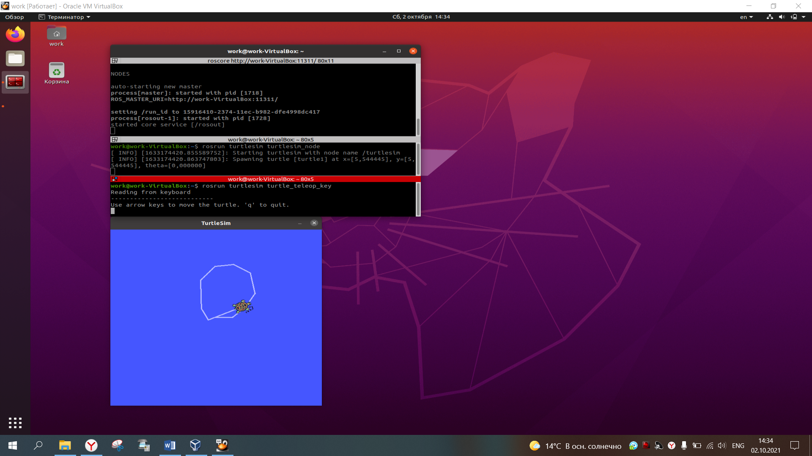

# Введение

## Установка операционной системы Linux (второй системой или на виртуальную машину)

Для установки используем [Ubuntu](https://ubuntu.com/download/desktop) версии 20.04 LTS.

### Установка Linux второй системой

Установка второй или основной системой производится следующими шагами:
- Перенос образа на USB Flash
- Запуск установки
- Настройка системы

### Установка системы в качестве виртуальной машины

- Устанавливаем [VirtualBox](https://www.virtualbox.org/wiki/Downloads). 
- Через меню устанавливаем систему из образа Ubuntu

## Установка ROS.

Установка ROS описана [на официальном сайте](http://wiki.ros.org/noetic/Installation/Ubuntu).

Не забываем после установки активировать системное рабочее пространство. Для этого нужно выполнить в терминале 2 команды:
```bash
echo "source /opt/ros/noetic/setup.bash" >> ~/.bashrc
source ~/.bashrc
```

## Скачивание всех необходимых пакетов

Следующим шагом скачаем и установим все нужные нам для работы пакеты ROS. Для установки чего-то на Ubuntu используется команда:
```bash
sudo apt-get install [имя пакета]
```
- Пакет для работы с TurtleBot3
    ```bash
    sudo apt-get install ros-noetic-turtlebot3-msgs ros-noetic-turtlebot3-gazebo
    ```
- Пакет стека навигации
    ```bash
    sudo apt-get install ros-noetic-navigation
    ```
- Пакет move_base
    ```bash
    sudo apt-get install ros-noetic-move-base
    ```
- Прочие пакеты для навигации и планирования
    ```bash
    sudo apt-get install ros-noetic-teb-local-planner ros-noetic-gmapping ros-noetic-hector-mapping
    ```
- Пакет turtlesim (это будет наш hello world) 
    ```bash
    sudo apt-get install ros-noetic-turtlesim
    ```


## Hello world

А теперь можно протестировать, что из этого всего вышло.

Первым делом проверим установленную версию ROS:
```bash
echo $ROS_DISTRO
```

На экране должно появиться: `noetic`.

Теперь попробуем запустить какой-нибудь пакет. Для этого установили Turtlesim. 

Для его запуска понадобится 3 окна терминала: 
- В первом окне запускаем ядро ROS командой 
    ```bash
    roscore
    ```
- В втором окне запустим программу с черепашкой
    ```bash
    rosrun turtlesim turtlesim_node
    ```
- В третьем окне запускаем программу для управления ею с клавиатуры 
    ```bash
    rosrun turtlesim turtle_teleop_key
    ```



Если все получилось, то УРА. Кажется, все установилось и работает 🎉
